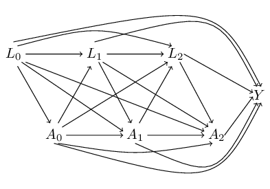

# causalinmisdata

[Go back to homepage](https://mcl868.github.io/software.html)

This package makes it possible to do causal inference in R and
it is possible to have data that are not fully observed.
Data are allow to a missing observations that follow a monotone pattern.
The package solves the issues to utilizes data better and to estimate an unbiased estimate.
Robins [1] defines the g-formula given by

<a href="https://www.codecogs.com/eqnedit.php?latex=E\left(Y^{\overline{a}_T}\right)=\int_{\mathcal{L}}&space;E(Y\mid&space;\overline{A}_T=\overline{a}_T,&space;\overline{L}_T=\overline{l}_T)&space;\prod_{t=0}^Tf_{L_t\mid&space;\overline{L}_{t-1},\overline{A}_{t-1}}(l_t\mid&space;\overline{l}_{t-1},\overline{a}_{t-1})&space;d\overline{l}_t." target="_blank"></a>

To install the package from GitHub then:
```markdown
install.packages("devtools")
devtools::install_github("mcl868/causalinmisdata")
```
If the package *devtools* is already installed then it is **not** necessary to use the command
*install.packages("devtools")*.
This package requires additional three packages
[HelpPackage](https://github.com/mcl868/HelpPackage/blob/master/README.md),
[combinat](https://cran.r-project.org/web/packages/combinat/index.html)
and
[gtools](https://cran.r-project.org/web/packages/gtools/index.html).
The example below shows how to use the package.

## The package contains following functions
- g.dicho (The estimator for the g-formula that utilizes data only complete cases)
- seq.mediator (The estimator for the sequential mediation that utilizes data only complete cases)
- missing.pattern (Help function)
- prob.of.missing (Help function)
- g.dr.dicho (The estimator for the g-formula that utilizes data with missing observations)
- seq.dr.mediator (The estimator for the sequential mediation that utilizes data with missing observations)
- monotone.pattern (Help function)

### g.dicho
The estimator for the g-formula for binary exposures and continuous outcomes
```markdown
g.dicho(mmodels,
        exposure,
        data, ...)
```
**Input**
- *mmodels*:  Models corresponding to response.
- *exposure*: The time-varying exposure.
- *data*:     Data.

**Output**
- *coef*:           The coefficients in marginal strucktural model.
- *ExpectEstimate*: The expected value of the potential outcome.
- *mmodels*:        The mmodels that have been used for modeling data.
- *exposure*:       The exposure of the analysis.
- *N*:              The sample size of data.
- *NCC*:            The sample size of complete cases of data. In case of no missing values *NCC* is equal to *N*.

For further information about the function write *?g.dicho* in R.


### seq.mediator
The estimator for sequential mediation for binary exposures and continuous outcomes
```markdown
seq.mediator(mmodels,
             exposure,
             int,
             data, ...)
```
**Input**
- *mmodels*:  Models corresponding to response.
- *exposure*: The time-varying exposure.
- *int*:      The exposure of interest for the mediation analysis.
- *data*:     Data.

**Output**
- *mmodels*:  The mmodels that have been used for modeling data.
- *coef*:     The coefficients from the analysis of the direct effect and the indirect effects.
- *exposure*: The exposure of the analysis.
- *N*:        The sample size of data.
- *NCC*:      The sample size of complete cases of data. In case of no missing values *NCC* is equal to *N*.

For further information about the function write *?seq.mediator* in R.


### missing.pattern
```markdown
missing.pattern(response,
                covariates,
                data, ...)
```
**Input**
- *response*:   The outcome variable of the interest.
- *covariates*: The ordered sequence of the variables of the interest without the response.
- *data*:       Data.

**Output**
- *data*:          The data of the chosen pattern of missingness (used in the function **prob.of.missing**).
- *covariatesObj*: The ordered sequence of the variables of the interest (used in the function **prob.of.missing**).
- *responseObj*:   The outcome variable of the interest (used in the function **prob.of.missing**).
- *count*:         The number of the observed variables in integers.
- *percent*:       The percent of the observed variables.

For further information about the function write *?missing.pattern* in R.


### prob.of.missing
```markdown
prob.of.missing(object,
                regression,
                list.out = TRUE,
                completecase = FALSE,
                regList,
                order=NULL, ...)
```
**Input**
- *object*:       The object is a *DataToPattern* and comes from the function **missing.pattern**.
- *regression*:   The models for stopping observing additional variables in a monotone pattern.
- *list.out*:     If it is equal to TRUE then output is a list, see **Output**.
If it is equal to FALSE then output is only data.
- *completecase*: If it is equal to TRUE then data.frame is only complete cases.
- *regList*:      The list consist of the models to estimate the probabilities for the missingness in data.
- *order*:        The order of measurement in data.

**Output**
- *regList*:  The regression models that been used to obtain lambda (exist *if list.out is equal to TRUE*).
- *CoefList*: The coefficients form the regression models (exist *if list.out is equal to TRUE*).
- *count*:    The numbers of the observed variables in integers (exist *if list.out is equal to TRUE*).
- *percent*:  The percent of the observed variables (exist *if list.out is equal to TRUE*).
- *data*:     The data of the chosen pattern of missingness ssh (exist *if list.out is equal to TRUE of FALSE*).

For further information about the function write *?prob.of.missing* in R.


### g.dr.dicho
The estimator for the g-formula for binary exposures and continuous outcomes with data
with missing observations following a monotone pattern
```markdown
g.dr.dicho(mmodels,
           exposure,
           covariates,
           regList,
           augList=NULL,
           data, ...)
```

**Input**
- *mmodels*:    Models corresponding to response.
- *exposure*:   The time-varying exposure.
- *covariates*: The ordered sequence of the variables of the interest without the response.
- *regList*:    The list consist of the models to estimate the probabilities for the missingness in data.
See the function **missing.pattern**.
- *augList*:    The list consist of the models of the Augmentations space.
All the models are linear by default (*augList=NULL*)
- *data*:       Data.

**Output**
- *ExpectEstimate*: The expected value of the potential outcome.
- *coef*:           The coefficients in marginal strucktural model.
- *mmodels*:        The mmodels that have been used for modeling data.
- *N*:              The sample size of data.
- *NCC*:            The sample size of complete cases of data. In case of no missing values *NCC* is equal to *N*.
- *exposure*:       The exposure of the analysis.
- *augList*:    The list consist of the models of the Augmentations space.
All the models are linear by default (*augList=NULL*)

For further information about the function write *?g.dr.dicho* in r.


### seq.dr.mediator
The estimator for sequential mediation for binary exposures and continuous outcomes with data
with missing observations following a monotone pattern
```markdown
seq.dr.mediator(mmodels,
                exposure,
                int,
                covariates,
                regList,
                augList=NULL,
                data, ...)
```
**Input**
- *mmodels*:    Models corresponding to response.
- *exposure*:   The time-varying exposure.
- *int*:        The exposure of interest for the mediation analysis.
- *covariates*: The ordered sequence of the variables of the interest without the response.
- *regList*:    The list consist of the models to estimate the probabilities for the missingness in data.
See the function **missing.pattern**.
- *augList*:    The list consist of the models of the Augmentations space.
All the models are linear by default (*augList=NULL*)
- *data*:       Data.

**Output**
- *coef*:     The coefficients from the analysis of the direct effect and the indirect effects.
- *mmodels*:  The mmodels that have been used for modeling data.
- *N*:        The sample size of data.
- *NCC*:      The sample size of complete cases of data. In case of no missing values *NCC* is equal to *N*.
- *exposure*: The exposure of the analysis.
- *regList*:    The list consist of the models to estimate the probabilities for the missingness in data.
See the function **missing.pattern**.
- *augList*:  The list consist of the models of the Augmentations space.
- *count*:    The number of the observed variables in integers.
- *CoefList*: The coefficients form the regression models (exist *if list.out is equal to TRUE*).

For further information about the function write *?seq.dr.mediator* in r.

### monotone.pattern
The estimator for sequential mediation for binary exposures and continuous outcomes with data
with missing observations following a monotone pattern
```markdown
monotone.pattern(measurements,
                 data,
                 id=NULL,
                 transform=TRUE,
                 threshold=0.05, ...)
```

**Input**
- *measurements*: The ordered sequence of the variables of the interest including the outcome.
- *data*:         Data.
- *id*:           If data variable of id.
- *transform*:    *If it is equal to TRUE* then all records following a nonmontone are set
to follow a monotone pattern.
*If it is equal to FALSE* then all records following a nonmontone are remain the same.
- *threshold*:    Remove pattern of from the monoene missingness if the percent of specific records
is below the threshold.

**Output**
- *data*:              Data.
- *transformnb*:       Contain the position of the record in data if the record follows a nonmontone
pattern. (If *transform=TRUE*).
- *tableC*:            The number of the observed variables in integers. See the function **missing.pattern**.
(If *transform=TRUE*).
- *tableCpercent*:     The percent of the observed variables.
(If *transform=TRUE*).
- *threshold*:         The value of the threshold.
(If *transform=TRUE*).
- *datasetredu*:       The records are removed from data if there are to few records of a specific pattern
below the threshold.
(If *transform=TRUE*).
- *tableCredu*:        The number of the observed variables in integers for the reduced data.
See the function **missing.pattern**. (If *transform=TRUE*).
- *tableCpercentredu*: The percent of the observed variables for the reduced data.
(If *transform=TRUE*).
- *nonmonotone*:       Contain the position of the record in data if the record follows a nonmontone
pattern. (If *transform=FALSE*)

For further information about the function write *?monotone.pattern* in r.

## Example with three exposures in the presence of time-dependent confounding
The directed acyclic graph (DAG) for the data is



Load the R-package into R.
```markdown
> library(causalinmisdata)
Indlæser krævet pakke: HelpPackage
Indlæser krævet pakke: gtools
Indlæser krævet pakke: combinat

Vedhæfter pakke: 'combinat'

Det følgende objekt er maskeret fra 'package:utils':

    combn

Advarselsbeskeder:
1: pakke 'gtools' blev bygget under R version 3.5.2
2: pakke 'combinat' blev bygget under R version 3.5.2
```

Simulate data with three exposure in the presence of time-dependent confounding and the ontinuous outcome.
```markdown
> p<-function(x)exp(x)/(1+exp(x))
>
> loop<-200
> NN<-2000
>
> set.seed(3)
> DataSetList<-list()
> for(iiii in 1:loop){
+   L0<-rnorm(NN)
+   A0<-1*(runif(NN,0,1)<=p(0.6*L0))
+
+   L1<--A0+0.2*L0-1*A0*L0+rnorm(NN)
+   A1<-1*(runif(NN,0,1)<=p(-1+1.6*A0+1.2*L1-0.8*L0-1.6*L1*A0))
+
+   L2<--A1+1*L1-A0+1.2*L0+rnorm(NN)
+   A2<-1*(runif(NN,0,1)<=p(1-0.8*L0+1.6*A0+1.2*L1+1.3*A1+0.5*L2+1.6*L1*A1))
+
+   Y<-2*L0+3*A0+1*L1+2*A1-2*L2+5*A2+L2*A2+rnorm(NN)
+
+   DataSetList[[iiii]]<-data.frame(L0, L1, L2, A0, A1, A2, Y)
+   rm(list=c("L0","L1","L2","A0","A1","A2","Y"))}
> rm("iiii")

```
Simulate the monotone missing pattern in the data.
```markdown
> DataSetListNA<-list()
> for(iiii in 1:loop){
+   REMOVE1<-with(DataSetList[[iiii]],1*(runif(nrow(DataSetList[[iiii]]),0,1)<=p(-3.2-1.9*L0)))
+   updata1<-DataSetList[[iiii]][REMOVE1==1,];upd1<-DataSetList[[iiii]][REMOVE1==0,]
+   updata1[,c("A0","L1","A1","L2","A2","Y")]<-NA
+
+   REMOVE2<-with(upd1,1*(runif(nrow(upd1),0,1)<=p(-3.5-1.7*L0+1.9*A0)))
+   updata2<-upd1[REMOVE2==1,];upd2<-upd1[REMOVE2==0,]
+   updata2[,c("L1","A1","L2","A2","Y")]<-NA
+
+   REMOVE3<-with(upd2,1*(runif(nrow(upd2),0,1)<=p(-3.1-1.9*L0+1.9*A0+1.5*L1)))
+   updata3<-upd2[REMOVE3==1,];upd3<-upd2[REMOVE3==0,]
+   updata3[,c("A1","L2","A2","Y")]<-NA
+
+   REMOVE4<-with(upd3,1*(runif(nrow(upd3),0,1)<=p(-3.7-1.6*L0+1.9*A0+1.5*L1+1.5*A1)))
+   updata4<-upd3[REMOVE4==1,];upd4<-upd3[REMOVE4==0,]
+   updata4[,c("L2","A2","Y")]<-NA
+
+   REMOVE5<-with(upd4,1*(runif(nrow(upd4),0,1)<=p(-3.8-1.6*L0+1.9*A0+1.5*L1+1.5*A1-L2)))
+   updata5<-upd4[REMOVE5==1,];upd5<-upd4[REMOVE5==0,]
+   updata5[,c("A2","Y")]<-NA
+
+   REMOVE6<-with(upd5,1*(runif(nrow(upd5),0,1)<=p(-4-1.6*L0+1.9*A0+1.5*L1+1.5*A1-L2+1.2*A2+1.2*A1*A2)))
+   updata6<-upd5[REMOVE6==1,];updata7<-upd5[REMOVE6==0,]
+   updata6[,c("Y")]<-NA
+
+ temp<-rbind(updata1,updata2,updata3,updata4,updata5,updata6,updata7)
+
+   DataSetListNA[[iiii]]<-temp[order(as.numeric(rownames(temp))),];rm("temp")}

```

Simulate the nonmonotone missing pattern in the data.
```markdown
> DataSetListNA.nonMonotone<-list()
> for(iiii in 1:loop){
+ DataSetListNA.nonMonotone[[iiii]]<-DataSetListNA[[iiii]]
+
+ DataSetListNA.nonMonotone[[iiii]]$L0[sample(c(1:NN),0.1*NN)]<-NA
+ DataSetListNA.nonMonotone[[iiii]]$L1[sample(c(1:NN),0.2*NN)]<-NA
+ DataSetListNA.nonMonotone[[iiii]]$L2[sample(c(1:NN),0.3*NN)]<-NA
+
+ DataSetListNA.nonMonotone[[iiii]]$A0[sample(c(1:NN),0.1*NN)]<-NA
+ DataSetListNA.nonMonotone[[iiii]]$A1[sample(c(1:NN),0.2*NN)]<-NA
+ DataSetListNA.nonMonotone[[iiii]]$A2[sample(c(1:NN),0.3*NN)]<-NA
+ }
>
> DataSetFull<-DataSetList
> DataSetMonotone<-DataSetListNA
> DataSetnonMonotone<-DataSetListNA.nonMonotone

```

## The models for the analysis
Define the models for the analysis.
```markdown
> regList<-list()
> regList[[1]]<-"L0"
> regList[[2]]<-"L0 + A0"
> regList[[3]]<-"L0 + A0 + L1"
> regList[[4]]<-"L0 + A0 + L1 + A1"
> regList[[5]]<-"L0 + A0 + L1 + A1 + L2"
> regList[[6]]<-"L0 + A0 + L1 + A1 + L2 + A2 + A1*A2"
>
> model1 <- Y ~ L0 + A0 + L1 + A1 + L2 + A2 + L2*A2
> model2 <- L2 ~ A1 + L1 + A0 + L0
> model3 <- L1 ~ A0 + L0 + A0*L0

```

## The use of the two functions  *missing.pattern* and *prob.of.missing*
```markdown
> DataSetCount<-Coef1List<-Coef2List<-Coef3List<-Coef4List<-Coef5List<-Coef6List<-list()
> for(iiii in 1:loop){
+   misdata<-missing.pattern(response = "Y",
+                            covariates = c("L0","A0","L1","A1","L2","A2"),
+                            data = DataSetMonotone[[iiii]])
+   DataSetCount[[iiii]]<-misdata$count
+
+   DataSetobj<-prob.of.missing(misdata, regList = regList)
+
+   Coef1List[[iiii]]<-DataSetobj$CoefList[[1]]
+   Coef2List[[iiii]]<-DataSetobj$CoefList[[2]]
+   Coef3List[[iiii]]<-DataSetobj$CoefList[[3]]
+   Coef4List[[iiii]]<-DataSetobj$CoefList[[4]]
+   Coef5List[[iiii]]<-DataSetobj$CoefList[[5]]
+   Coef6List[[iiii]]<-DataSetobj$CoefList[[6]]}
>
> listMean(DataSetCount)

       1        2        3        4        5        6      Inf      Sum
 217.175  214.555  179.400  125.990  252.965  154.050  855.865 2000.000
>
> round(listMean(Coef1List),3)
(Intercept)          L0
     -3.211      -1.916
> round(listMean(Coef2List),3)
(Intercept)          L0          A0
     -3.534      -1.720       1.921
> round(listMean(Coef3List),3)
(Intercept)          L0          A0          L1
     -3.100      -1.901       1.900       1.503
> round(listMean(Coef4List),3)
(Intercept)          L0          A0          L1          A1
     -3.704      -1.604       1.875       1.506       1.506
> round(listMean(Coef5List),3)
(Intercept)          L0          A0          L1          A1          L2
     -3.856      -1.610       1.908       1.511       1.529      -1.012
> round(listMean(Coef6List),3)
(Intercept)          L0          A0          L1          A1          L2
     -4.078      -1.632       1.917       1.483       1.536      -0.998
         A2       A1:A2
      1.243       1.186

```

## The use of the two functions  *g.dicho* and  *g.dr.dicho*
The use of the *g.dicho* function on data. It applies both for full data and
data with missing observations.
```markdown
> estimationSG<-
+ lapply(1:loop,function(iiii) g.dicho(mmodels=c(model1,model2,model3),
+                                      exposure=c("A0","A1","A2"),
+                                      data=DataSetFull[[iiii]])$coef)
> round(listMean(estimationSG),3)
     (Intercept)    A0    A1    A2 A0*A1  A0*A2  A1*A2 A0*A1*A2
Est.       -0.01 5.997 4.011 5.008     0 -1.997 -1.006        0
>
> estimationSG.NA<-
+ lapply(1:loop,function(iiii) g.dicho(mmodels=c(model1,model2,model3),
+                                      exposure=c("A0","A1","A2"),
+                                      data=DataSetMonotone[[iiii]])$coef)
> round(listMean(estimationSG.NA),3)
     (Intercept)    A0    A1    A2 A0*A1  A0*A2  A1*A2 A0*A1*A2
Est.      -0.255 6.442 3.583 5.743     0 -2.551 -0.793        0

```

The use of the *g.dr.dicho* function on data. It applies only for data with missing observations.
```markdown
> estimationMis.SG<-
+ lapply(1:loop,function(iiii) g.dr.dicho(mmodels=c(model1,model2,model3),
+                                         exposure=c("A0","A1","A2"),
+                                         data=DataSetMonotone[[iiii]],
+                                         covariates=c("L0","A0","L1","A1","L2","A2"),
+                                         regList=regList)$coef)
> round(listMean(estimationMis.SG),3)
     (Intercept)    A0    A1    A2 A0*A1  A0*A2 A1*A2 A0*A1*A2
Est.      -0.021 5.996 4.015 5.014     0 -1.998 -1.01        0

```

Use the *g.dicho* function on data. It applies both for full data and
data with missing observations.

## The use of the two functions  *seq.mediator* and  *seq.dr.mediator*
The use of the *seq.mediator* function on data. It applies both for full data and
data with missing observations.

The estimation is with full data
```markdown
> estimationSeqM.A0<-
+ lapply(1:loop,function(iiii) seq.mediator(mmodels=c(model1,model2,model3),
+                                           exposure=c("A0","A1","A2"),
+                                           int="A0",
+                                           data=DataSetFull[[iiii]])$coef)
> round(listMean(estimationSeqM.A0),3)
      dir indir_M1 indir_M2 overall
Est 3.006    0.993    1.998   5.997
>
> estimationSeqM.A1<-
+ lapply(1:loop,function(iiii) seq.mediator(mmodels=c(model1,model2,model3),
+                                           exposure=c("A0","A1","A2"),
+                                           int="A1",
+                                           data=DataSetFull[[iiii]])$coef)
> round(listMean(estimationSeqM.A1),3)
    dir indir_M1 overall
Est   2    2.011   4.011
>
> estimationSeqM.A2<-
+ lapply(1:loop,function(iiii) seq.mediator(mmodels=c(model1,model2,model3),
+                                           exposure=c("A0","A1","A2"),
+                                           int="A2",
+                                           data=DataSetFull[[iiii]])$coef)
> round(listMean(estimationSeqM.A2),3)
      dir overall
Est 5.008   5.008

```

The estimation is with observed data with missing observations
```markdown
> estimationSeqM.A0.NA<-
+ lapply(1:loop,function(iiii) seq.mediator(mmodels=c(model1,model2,model3),
+                                           exposure=c("A0","A1","A2"),
+                                           int="A0",
+                                           data=DataSetMonotone[[iiii]])$coef)
> round(listMean(estimationSeqM.A0.NA),3)
      dir indir_M1 indir_M2 overall
Est 3.001    1.812    1.629   6.442
>
> estimationSeqM.A1.NA<-
+ lapply(1:loop,function(iiii) seq.mediator(mmodels=c(model1,model2,model3),
+                                           exposure=c("A0","A1","A2"),
+                                           int="A1",
+                                           data=DataSetMonotone[[iiii]])$coef)
> round(listMean(estimationSeqM.A1.NA),3)
      dir indir_M1 overall
Est 1.998    1.585   3.583
>
> estimationSeqM.A2.NA<-
+ lapply(1:loop,function(iiii) seq.mediator(mmodels=c(model1,model2,model3),
+                                           exposure=c("A0","A1","A2"),
+                                           int="A2",
+                                           data=DataSetMonotone[[iiii]])$coef)
> round(listMean(estimationSeqM.A2.NA),3)
      dir overall
Est 5.743   5.743

```
The use of the *seq.dr.mediator* function on data. It applies only for data with missing observations.
```markdown
> estimationMis.SeqM.A0<-
+ lapply(1:loop,function(iiii) seq.dr.mediator(mmodels=c(model1,model2,model3),
+                                              exposure=c("A0","A1","A2"),
+                                              int="A0",
+                                              data=DataSetMonotone[[iiii]],
+                                              covariates=c("L0","A0","L1","A1","L2","A2"),
+                                              regList=regList)$coef)
> round(listMean(estimationMis.SeqM.A0),3)
      dir indir_M1 indir_M2 overall
Est 3.001    0.993    2.003   5.996
>
> estimationMis.SeqM.A1<-
+ lapply(1:loop,function(iiii) seq.dr.mediator(mmodels=c(model1,model2,model3),
+                                              exposure=c("A0","A1","A2"),
+                                              int="A1",
+                                              data=DataSetMonotone[[iiii]],
+                                              covariates=c("L0","A0","L1","A1","L2","A2"),
+                                              regList=regList)$coef)
> round(listMean(estimationMis.SeqM.A1),3)
      dir indir_M1 overall
Est 1.998    2.017   4.015
>
> estimationMis.SeqM.A2<-
+ lapply(1:loop,function(iiii) seq.dr.mediator(mmodels=c(model1,model2,model3),
+                                              exposure=c("A0","A1","A2"),
+                                              int="A2",
+                                              data=DataSetMonotone[[iiii]],
+                                              covariates=c("L0","A0","L1","A1","L2","A2"),
+                                              regList=regList)$coef)
> round(listMean(estimationMis.SeqM.A2),3)
      dir overall
Est 5.014   5.014

```
## The use of the two functions *monotone.pattern*
In case of the data have missing observations following a nonmonotone and you want to make a
sensitive analysis.
The *monotone.pattern* will helps to transform the pattern from nonmonotone to monotone.
```markdown
> DataSetnonMonotone.extra<-
+ lapply(1:loop,function(iiii)
+        monotone.pattern(measurements=c("L0","A0","L1","A1","L2","A2","Y"),
+                         data=DataSetnonMonotone[[iiii]],
+                         id=NULL,
+                         transform=TRUE,
+                         threshold=0.05))
>
> listMean(lapply(1:loop,function(iiii)length(DataSetnonMonotone.extra[[iiii]]$transformnb)))
[1] 926.56
> listMean(lapply(1:loop,function(iiii)length(DataSetnonMonotone.extra[[iiii]]$transformnb)))/NN
[1] 0.46328
>
> regList
[[1]]
[1] "L0"

[[2]]
[1] "L0 + A0"

[[3]]
[1] "L0 + A0 + L1"

[[4]]
[1] "L0 + A0 + L1 + A1"

[[5]]
[1] "L0 + A0 + L1 + A1 + L2"

[[6]]
[1] "L0 + A0 + L1 + A1 + L2 + A2 + A1*A2"

> regList[[6]]<-"L0 + A0 + L1 + A1 + L2 + A2"
> regList
[[1]]
[1] "L0"

[[2]]
[1] "L0 + A0"

[[3]]
[1] "L0 + A0 + L1"

[[4]]
[1] "L0 + A0 + L1 + A1"

[[5]]
[1] "L0 + A0 + L1 + A1 + L2"

[[6]]
[1] "L0 + A0 + L1 + A1 + L2 + A2"

>
>
> DataSetCount.e<-Coef1List.e<-Coef2List.e<-Coef3List.e<-Coef4List.e<-Coef5List.e<-Coef6List.e<-list()
> for(iiii in 1:loop){
+   misdata.e<-missing.pattern(response = "Y",
+                            covariates = c("L0","A0","L1","A1","L2","A2"),
+                            data = DataSetnonMonotone[[iiii]])
+   DataSetCount.e[[iiii]]<-misdata.e$count
+
+   DataSetobj.e<-prob.of.missing(misdata.e, regList = regList)
+
+   Coef1List.e[[iiii]]<-DataSetobj.e$CoefList[[1]]
+   Coef2List.e[[iiii]]<-DataSetobj.e$CoefList[[2]]
+   Coef3List.e[[iiii]]<-DataSetobj.e$CoefList[[3]]
+   Coef4List.e[[iiii]]<-DataSetobj.e$CoefList[[4]]
+   Coef5List.e[[iiii]]<-DataSetobj.e$CoefList[[5]]
+   Coef6List.e[[iiii]]<-DataSetobj.e$CoefList[[6]]}
>
> round(listMean(DataSetCount),3)

       1        2        3        4        5        6      Inf      Sum
 217.175  214.555  179.400  125.990  252.965  154.050  855.865 2000.000
> round(listMean(DataSetCount.e),3)

       1        2        3        4        5        6      Inf      Sum
 218.695  209.905  143.335  111.545  108.670   39.395  217.630 1049.175
>
>
> round(listMean(Coef1List),3)
(Intercept)          L0
     -3.211      -1.916
> round(listMean(Coef2List),3)
(Intercept)          L0          A0
     -3.534      -1.720       1.921
> round(listMean(Coef3List),3)
(Intercept)          L0          A0          L1
     -3.100      -1.901       1.900       1.503
> round(listMean(Coef4List),3)
(Intercept)          L0          A0          L1          A1
     -3.704      -1.604       1.875       1.506       1.506
> round(listMean(Coef5List),3)
(Intercept)          L0          A0          L1          A1          L2
     -3.856      -1.610       1.908       1.511       1.529      -1.012
> round(listMean(Coef6List),3)
(Intercept)          L0          A0          L1          A1          L2
     -4.078      -1.632       1.917       1.483       1.536      -0.998
         A2       A1:A2
      1.243       1.186
>
> round(listMean(Coef1List.e),3)
(Intercept)          L0
     -2.345      -1.540
> round(listMean(Coef2List.e),3)
(Intercept)          L0          A0
     -2.285      -1.336       1.356
> round(listMean(Coef3List.e),3)
(Intercept)          L0          A0          L1
     -2.026      -1.458       1.528       1.161
> round(listMean(Coef4List.e),3)
(Intercept)          L0          A0          L1          A1
     -2.260      -1.246       1.353       0.823       1.323
> round(listMean(Coef5List.e),3)
(Intercept)          L0          A0          L1          A1          L2
     -3.002      -1.527       1.762       1.497       1.550      -0.939
> round(listMean(Coef6List.e),3)
(Intercept)          L0          A0          L1          A1          L2
     -4.634      -1.713       1.950       1.631       2.349      -1.049
         A2
      1.910

```

It is now possible to analysis data with the two functions
*g.dr.dicho* and *seq.dr.mediator*.
```markdown
> estimationMis.SG.e<-
+ lapply(1:loop,function(iiii) g.dr.dicho(mmodels=c(model1,model2,model3),
+                                         exposure=c("A0","A1","A2"),
+                                         data=DataSetnonMonotone.extra[[iiii]]$data,
+                                         covariates=c("L0","A0","L1","A1","L2","A2"),
+                                         regList=regList)$coef)
> round(listMean(estimationMis.SG.e),3)
     (Intercept)    A0    A1    A2 A0*A1  A0*A2  A1*A2 A0*A1*A2
Est.      -0.013 5.992 3.982 5.006     0 -1.984 -1.002        0
>
>
> estimationMis.SeqM.A0.e<-
+ lapply(1:loop,function(iiii) seq.dr.mediator(mmodels=c(model1,model2,model3),
+                                              exposure=c("A0","A1","A2"),
+                                              int="A0",
+                                              data=DataSetnonMonotone.extra[[iiii]]$data,
+                                              covariates=c("L0","A0","L1","A1","L2","A2"),
+                                              regList=regList)$coef)
> round(listMean(estimationMis.SeqM.A0.e),3)
      dir indir_M1 indir_M2 overall
Est 3.015    0.991    2.014   6.021
>
> estimationMis.SeqM.A1.e<-
+ lapply(1:loop,function(iiii) seq.dr.mediator(mmodels=c(model1,model2,model3),
+                                              exposure=c("A0","A1","A2"),
+                                              int="A1",
+                                              data=DataSetnonMonotone.extra[[iiii]]$data,
+                                              covariates=c("L0","A0","L1","A1","L2","A2"),
+                                              regList=regList)$coef)
> round(listMean(estimationMis.SeqM.A1.e),3)
      dir indir_M1 overall
Est 1.982    2.023   4.006
>
> estimationMis.SeqM.A2.e<-
+ lapply(1:loop,function(iiii) seq.dr.mediator(mmodels=c(model1,model2,model3),
+                                              exposure=c("A0","A1","A2"),
+                                              int="A2",
+                                              data=DataSetnonMonotone.extra[[iiii]]$data,
+                                              covariates=c("L0","A0","L1","A1","L2","A2"),
+                                              regList=regList)$coef)
> round(listMean(estimationMis.SeqM.A2.e),3)
      dir overall
Est 5.005   5.005

```

### Bibliography
- [1] James Robins. A new approach to causal inference in mortality studies with a sustained
exposure period--application to control of the healthy worker survivor effect (book review).
Mathematical Modelling, 7(9-12):1393-1512, 1986.
